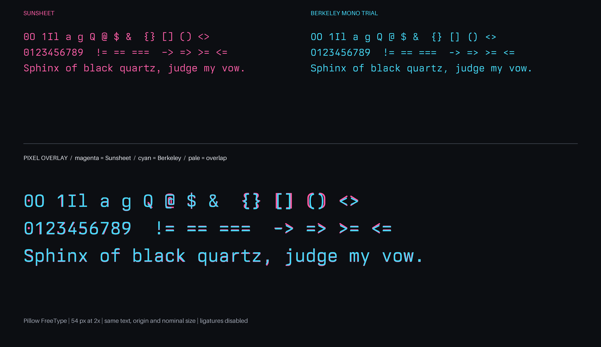

# Sunsheet

<p align="center">
  <strong>A full-coverage geometric monospace webfont built with Iosevka.</strong><br>
  Cyrillic, Greek, programming ligatures, two widths, ten weights, and real italics.
</p>

Sunsheet preserves the glyph choices and metrics of Ioskeley Mono under a new,
distinct family name. It is distributed only as a full WOFF2 web family.

## Distribution

Sunsheet ships one release artifact: **`Sunsheet-Web-Full.zip`**.

- 40 static WOFF2 faces: 10 weights × 2 widths × upright/italic
- Normal and SemiCondensed widths
- complete Iosevka glyph repertoire retained
- Cyrillic and Greek included
- programming ligatures and OpenType features included
- no Latin-only subset, desktop, terminal, Nerd Font, or no-ligature packages

## High-fidelity web rendering

Copy `WOFF2/` and `sunsheet.css` from the archive to the same public directory:

```html
<link
  rel="preload"
  href="/fonts/WOFF2/Sunsheet-Regular.woff2"
  as="font"
  type="font/woff2"
  crossorigin
>
<link rel="stylesheet" href="/fonts/sunsheet.css">
```

```css
:root { font-synthesis: none; }

code,
pre,
kbd,
samp {
  font-family: "Sunsheet", monospace;
  font-weight: 400;
  font-stretch: normal;
  font-variant-ligatures: contextual;
  line-height: 1.55;
  tab-size: 4;
}
```

For the most faithful output:

1. Use WOFF2 generated directly from the pinned source build.
2. Load the real weight and italic face; never rely on synthetic bold or oblique.
3. Do not scale text with CSS transforms or globally alter letter spacing.
4. Preload only the above-the-fold face.
5. Serve versioned files as `font/woff2` with immutable caching.
6. Verify Chrome, Safari, and Firefox on both 1× and 2× displays.

The complete family is about 19 MiB; individual faces are approximately
450–519 KiB. Browsers fetch only matched `@font-face` resources, but production
pages should still include or preload only the weights, styles, and widths they
actually use.

There is no browser “ultra quality” switch. CoreText, DirectWrite, and FreeType
rasterize the same outlines differently. Sunsheet maximizes source fidelity and
prevents avoidable browser synthesis; it cannot force pixel-identical output on
every operating system.

## At a Glance

- **40 static WOFF2 faces:** 10 weights × 2 widths × upright and italic.
- **Distinctive glyph choices:** dotted zero, single-storey `g`, open `6` and `9`, two-circle `8`, flat-arc parentheses, a raised underscore, and square punctuation dots.
- **Programming ligatures:** retained, with CSS control through `font-variant-ligatures` and OpenType features.
- **Full coverage:** Latin, Greek, Cyrillic, arrows, mathematics, box drawing, and the remaining Iosevka repertoire.

## Design

The build plan defines Normal advance 600, SemiCondensed advance 540, x-height
520, cap height 690, ascender 740, side bearing 85, leading 1250, and an 11.8°
italic. These are source metrics, not claims of metric identity with Berkeley
Mono.

## Difference from Berkeley Mono

Sunsheet is an independent Iosevka configuration, not a copy of Berkeley Mono
font files or outlines. Measurements below compare Sunsheet Regular with the
locally licensed `BerkeleyMonoTrial-Regular.otf`; both use 1000 units per em.
They do not characterize Berkeley's other weights or italics.

| Regular-face metric | Sunsheet | Berkeley Mono trial |
| --- | ---: | ---: |
| advance width | 600 | 600 |
| x-height | 520 | 518 |
| cap height | 690 | 680 |
| `hhea` ascent | 965 | 956 |
| `hhea` descent | -220 | -244 |
| `hhea` line gap | 65 | 0 |

Matching 600-unit advances explain the similar code density, but the vertical
metrics are not identical. Representative outline bounds also differ: `Q` is
`(77, -52, 559, 698)` in Sunsheet versus `(63, -97, 536, 690)` in the Berkeley
trial; `@` is `(43, -64, 557, 744)` versus `(55, -88, 544, 690)`.

Available Regular specimens show:

| Glyph/group | Observed difference |
| --- | --- |
| `a`, `g` | Bowl geometry, joins, apertures, and terminals differ. |
| `0` | Outer oval, weight distribution, and internal mark differ. |
| `Q` | Tail origin, angle, length, and bowl intersection differ. |
| `@` | Outer bowl, inner construction, aperture, and lower join differ. |
| `$` | `S` contour and vertical-stroke intersections differ. |
| `1`–`9` | Tops, bowls, diagonals, and terminals differ despite close cell rhythm. |
| `I`, `l`, `i` | Serif construction, stem proportions, and dot treatment differ. |
| `()[]{}` | Curvature, corners, and vertical reach differ. |
| operators | Sunsheet uses Iosevka contextual ligatures; contours and substitutions are not identical. |

The upstream overlay demonstrates close baseline and cell advance only for its
selected Regular glyphs and render settings. It does not establish identical
outlines, hinting, all weights, all Unicode characters, or all browsers.

The repository retains the original public comparison images for provenance:


## Weights

Every weight is included in both widths, with an upright and italic style.

| Weight | CSS `font-weight` | Upright | Italic |
|---|---:|:---:|:---:|
| Thin | `100` | Included | Included |
| ExtraLight | `200` | Included | Included |
| Light | `300` | Included | Included |
| SemiLight | `350` | Included | Included |
| Regular | `400` | Included | Included |
| Medium | `500` | Included | Included |
| SemiBold | `600` | Included | Included |
| Bold | `700` | Included | Included |
| ExtraBold | `800` | Included | Included |
| Black | `900` | Included | Included |

## Installation

Extract `Sunsheet-Web-Full.zip` into your public font directory. The archive
contains `WOFF2/`, `sunsheet.css`, this README, and the OFL licence. Import the
stylesheet and use `font-family: "Sunsheet", monospace`.

The CSS declares every real weight, style, and width. Use
`font-stretch: semi-condensed` for the 90% width and `font-stretch: normal` for
the default width.

## OpenType Features

Sunsheet includes OpenType features that compatible browsers can enable or disable.

| Feature | Effect |
|---|---|
| `zero` | Uses a slashed zero instead of the default dotted zero |
| `calt` | Enables contextual programming ligatures. On by default where supported |
| `dlig` | Enables discretionary ligatures |
| `onum` | Uses old-style figures |
| `frac` | Formats fractions |

```css
font-variant-ligatures: contextual;
font-feature-settings: "calt" 1, "zero" 1;
```

## Reproducible local overlay

A true new overlay requires a locally licensed Berkeley Mono font. Render both
fonts with the same face, size, DPI, renderer, feature settings, origin, and
baseline. Do not commit or redistribute the Berkeley binary. A generated raster
comparison documents only those exact conditions, not every browser or platform.

```bash
python3 -m pip install pillow
python3 tools/render-berkeley-overlay.py \
  --sunsheet-font Iosevka/dist/Sunsheet/TTF/Sunsheet-Regular.ttf \
  --berkeley-font /path/to/licensed/BerkeleyMono-Regular.otf \
  --output assets/Sunsheet-vs-Berkeley-FreeType-Overlay.png
```



## Build from Source

The release workflow pins Iosevka `v34.4.0`:

```bash
git clone --branch v34.4.0 --depth 1 https://github.com/be5invis/Iosevka.git
cp private-build-plans.toml Iosevka/
cd Iosevka
npm ci
npm run build -- woff2::Sunsheet
```

Generated fonts are written to `Iosevka/dist/Sunsheet/WOFF2/`. The workflow
verifies all 40 faces, the Sunsheet family name, representative Cyrillic glyphs,
and equal advances before creating `Sunsheet-Web-Full.zip`.

## License & Acknowledgments

Sunsheet remains under the [SIL Open Font License 1.1](./LICENSE). The original
Ioskeley Mono copyright and attribution are preserved. Iosevka was created by
Belleve Invis and contributors. Berkeley Mono is a commercial typeface by Neil
Panchal / Berkeley Graphics. Sunsheet is independent and is not affiliated with
or endorsed by Berkeley Graphics.
